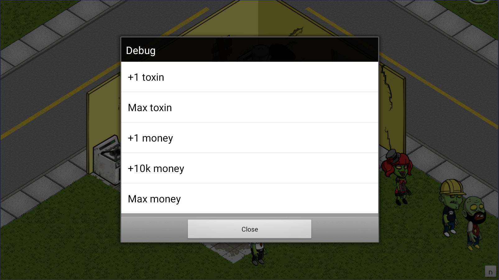



# Zombie Cafe Revival 2.0

This is my fork of [Airyzz/zombie-cafe-revival](https://github.com/Airyzz/zombie-cafe-revival). Huge thanks to Airyzz for reverse engineering and reviving Zombie Cafe, and for making the original project available.

My intention with this fork is to keep the original revival work intact while adding a small optional mod menu for easier testing and casual gameplay in BlueStacks/Android. I also started bringing in stability fixes so the game crashes less on newer Android/BlueStacks setups.

## Download

Latest APK from this fork: [ZombieCafeRevival-2.0-ModMenu-v1.1.apk](release/ZombieCafeRevival-2.0-ModMenu-v1.1.apk)

Current release: v1.1

## Tested Setup

This fork is currently tested on Windows PC using BlueStacks Android 11 64-bit.

The APK may not install or run correctly on every real Android phone or tablet. Zombie Cafe uses old 32-bit ARM native libraries, and many modern Android devices now require or prefer `arm64-v8a` support. Because this project does not currently include a native `arm64-v8a` build of the original game library, some devices can fail with ABI/compatibility errors.

## Installing On BlueStacks

1. Download the APK from the release page or from the `release` folder.
2. Open BlueStacks on Windows.
3. Drag the APK into the BlueStacks window, or use BlueStacks' APK install option.
4. Launch Zombie Cafe after the install finishes.

If you already have Zombie Cafe installed, installing this APK with the same package name can replace the existing app. Make a BlueStacks backup first if you want to protect your save.

## What This Fork Adds

This fork adds a small in-game mod menu with:

- +1 toxin
- Max toxin
- +1 money
- +10k money
- Max money
- +10k XP
- Max XP

It also includes native stability fixes ported from [edbuildingstuff/zombie-cafe-revival](https://github.com/edbuildingstuff/zombie-cafe-revival), including Scudo/heap crash fixes and an MD5 save-hashing off-by-one patch. Thanks to edbuildingstuff for tracking those crashes down and documenting the fixes.



## Known Compatibility Notes

- Tested mainly on BlueStacks Android 11 64-bit for Windows.
- Real Android device support can vary.
- Devices that require `arm64-v8a` only may not be able to install or run this APK.
- This fork currently keeps the original 32-bit native game library setup.

## Original Project

The original Zombie Cafe Revival project is an effort to reverse engineer and revive the game, reimplementing online services, fixing crashes, and adding new content.

You can read Airyzz's technical article here: [Zombie Cafe Revival article](https://airyz.xyz/p/zombie-cafe-revival/)

## Building

### Requirements

- cmake
- make
- go
- apktool
- jarsigner

### LibZombieCafeExtension

LibZombieCafeExtension is an extra library that applies runtime patches to the game's `libZombieCafeAndroid.so`.

```bash
cd src/lib/cpp
mkdir build
cd build
cmake ../ -DCMAKE_TOOLCHAIN_FILE=$NDK_HOME/build/cmake/android.toolchain.cmake -DANDROID_ABI=armeabi-v7a -DANDROID_PLATFORM=android-8

make
```

### Running Tools

Part of the build process for this project is running custom tools to convert the human readable file structure into the game's expected file formats.

```bash
go run ./tool/build_tool/ -i src/ -o build/

cp src/lib/cpp/build/libZombieCafeExtension.so ./build/lib/armeabi/libZombieCafeExtension.so

apktool b ./build -o ./build/out/out.apk

jarsigner -verbose -keystore debug.keystore -storepass zombiecafe ./build/out/out.apk alias_name

adb install -r ./build/out/out.apk
```


